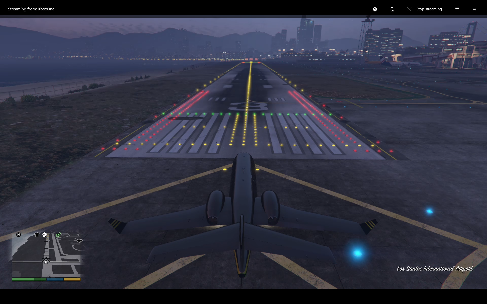
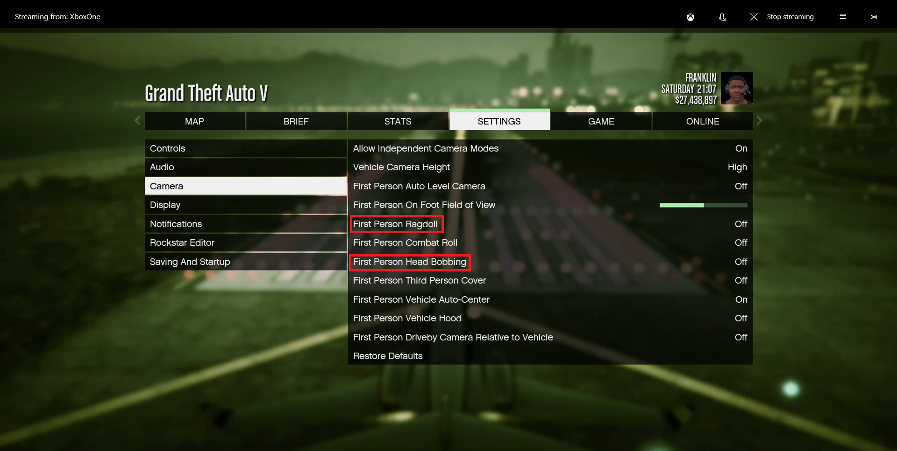
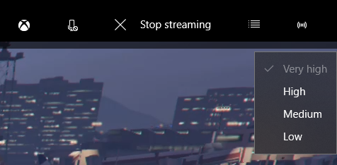

# GTA Pilot: Fly airplanes in GTA V on Xbox One

The goal of this research project is to intercept the Xbox app game streaming and control the game with an AI player.  This goal is achieved, and there is a simple autoflight system that will execute a predefined flight plan including a takeoff and landing.

#### Overview
The main componnets are:
- A Frida script to read and write the data that flows through XInputGetState in xboxapp.exe
- A library of code written against EmguCV that reads data from the cockpit indicators and turns them into normalized values
- An AI pilot module to aggregate the data and execute commands against the game

#### Realtime data from image processing

The view is split into 4 rows (each column corresponds to the indicator at the top):
- Indicator with yellow value overlay
- Sampled data
- Output data
- Data servicing delay

There is a simple autoflight system, a basic flight director, modern primary flight/navigation displays, a virtual Inertial Reference System based on compass heading and airspeed.  Simple PID controllers are used to maintain a setpoint for pitch and roll control.

I haven't yet figured out how to model the relationship between thrust and momentum, so there is sideslip error and we open the map to get a known position.  For this reason the **Franklin avatar must be used** as we expect to find the green hangar building.

## Requirements:
- Two 1920x1200 displays, system DPI set to 100%
- Xbox app & controller
- GTA V
- Franklin avatar must have a hangar at the Los Santos Airport

## Instructions
For simplicity sake, you must start at a predefined location in the first-person view of the Luxor or Shamal airplane.

#### Start position
A starting position must be set in the game.  Create a save point in the Luxor or Shamal airplane, in the blast zone for RW3 at Los Santos airport.  Other airplanes will **not** work.

#### Game settings

Verify options under **Settings** / **Camera**:
- Head Bobbing: **Off**
- Ragdoll: **Off**

Ensure that Streaming Quality is set to **Very High**

- Start the Xbox app, proceed to the LS RW3 start position
- Keep the app in **fullscreen** mode
- Start GTA Pilot
- Set focus to the Xbox streaming window, and observe the view move down as it locks
- Press **CAMERA** button on the controller to activate the flight plan, engage autopilot modes and begin the flight

## More information

### Autopilot Modes:
- HDG SEL: Heading Select, turn to and hold a heading
- VS: Vertical speed, maintain a vertical speed ignoring other factors (i.e. airspeed)
- ALT HOLD: Climb or Descend and maintain and altitude
- LNAV: Internally uses HDG SEL to navigate to track the navigation line
- IAS: Maintain speed using thrust lever control